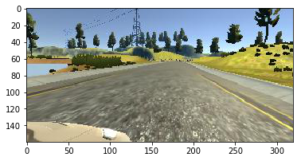

# Behavioral Cloning

[](http://www.udacity.com/drive)


## Overview
The goal of this **Behavioral Cloning Project** is to build a convolution neural network in Keras that predicts steering angles from images collected using simulator so that the model can successfully drive around tracks without leaving the road.


### Autonomous Driving Simulation Video
You can watch my car autonomously drive around both lake track and jungle track here:

- [Lake Track Simulation](https://www.youtube.com/watch?v=bJPQDfu15sc)
- [Jungle Track Simulation](https://www.youtube.com/watch?v=eu2-NLfhzYQ)

I also implemented an autonomous version to drive using PID controller, instead of the neural network. Feel free to check out the [code](https://goo.gl/VFo99v), or watch the [Lake Track simulation controlled by a PID controller](https://youtu.be/poxOXTRucyQ)

### Run Autonomous Mode Yourself
Make sure you have the CarND environment set up, activated, and have both the code and simulator downloaded in the same folder. If you haven't yet, follow instructions in the next section.

The general syntax for running autonomous mode using a specified model is 
```
python drive.py <your model>
```

For example, the car can be driven autonomously around the track using provided model by first executing 
```
python drive.py model.h5
```

Then, open the simulator and set screen resolution to  "640x480" and graphics quality to "good". Then, select the track you want and click "autonomous" mode.

**Suggestions**: to get the best result, it is recommended to set `set_speed = 15` (line 47) in `drive.py` file for lake track for faster drive, and set `set_speed = 7` (line 47) in `drive.py` file for jungle track for smoother drive. Sometimes, the car will stop and stuck in the middle of jungle road, so simply press `s` key (brake) on your keyboard and it should get moving again.

## Get The Project

### Dependencies
This project requires [CarND Term1 Starter Kit](https://github.com/udacity/CarND-Term1-Starter-Kit). The environment can be created with CarND Term1 Starter Kit. Click [here](https://github.com/udacity/CarND-Term1-Starter-Kit/blob/master/README.md) for the details.

### Get the Code
- Download the Simulator for your environment:
    - [Linux](https://d17h27t6h515a5.cloudfront.net/topher/2017/February/58ae46bb_linux-sim/linux-sim.zip)
    - [macOS](https://d17h27t6h515a5.cloudfront.net/topher/2017/February/58ae4594_mac-sim.app/mac-sim.app.zip)
    - [Windows](https://d17h27t6h515a5.cloudfront.net/topher/2017/February/58ae4419_windows-sim/windows-sim.zip)
    - _**NOTE**: On Windows 8 there is an issue where `drive.py` is unable to establish a data connection with the simulator. If you are running Windows 8 It is advised to upgrade to Windows 10, which should be free, and then you should be able to run the project properly._
- If you want to train your own network, you can get a sample of training data for lake track [here](https://d17h27t6h515a5.cloudfront.net/topher/2016/December/584f6edd_data/data.zip) and a sample of starter code repo [here](https://github.com/udacity/CarND-Behavioral-Cloning-P3)

## Model Architecture

#### 1. Solution Design Approach

The overall strategy for deriving a model architecture was to experiment existing network architectures and to fine tune the ones that work the best.

My first step was to use a convolution neural network model similar to the VGGNet architecture. I thought this model might be appropriate because it is a common starting point that works well for image related tasks.

In order to gauge how well the model was working, I split my image and steering angle data into a training and validation set. I found that my first model had a high mean squared error on the training set and a high mean squared error on the validation set. This implied that the model was underfitting. 

To combat the underfitting, I modified the model so that it has more and deeper layers. The resulting performance has a lower traning and validation error, but the car still has trouble at places where there are sharp turns.

Then I looked through the discussions and advics in the nanodegree community, and found out the following two insights:

- The training data steering angle distribution has a high number of 0s (so going stright without turning) for lake track, and 0/1/-1 (turning left and right) for jungle track due to the nature of the tracks. Therefore, the network tends to be biased towards these angles and have trouble generalizing and working well at sharp turns.
- The NVIDIA Architecture for self driving car end-to-end learning works best.

Thus, I resampled the training data and redistributed the data to remove the bias towards 0/1/-1 angles. I will discuss how I achieved this in the "Data Preprocessing & Augmentation" section later. I also switched architecture to the NVIDIA architecture. 

After fine tuning parameters a little bit, I have found a working final model architecture and the vehicle is able to drive autonomously around the track without leaving the road.

#### 2. Final Model Architecture

My final model mainly uses the network architecture recommended by NVIDIA for self driving car end-to-end learning in this [blog](https://devblogs.nvidia.com/parallelforall/deep-learning-self-driving-cars/).

The below figure shows the network architecture, which consists of 9 layers, including a normalization layer, 5 convolutional layers, and 3 fully connected layers. 


The model includes ELU as activation functions as suggested by some people in the nanodegree community.

#### 3. Reduce Overfitting

The model contains dropout layers in order to reduce overfitting. Dropout layers initially have 50% keep probability, but during the fine tuning process (described later), I have manually, gradually increased the keep probability up to 90%, depending on the stage of fine tuning.

The model was trained and validated on different data sets to ensure that the model was not overfitting. The model was tested by running it through the simulator and ensuring that the vehicle could stay on the track.

#### 4. Model Parameter Tuning

The model used an adam optimizer, so the learning rate was not tuned manually. By checking training loss v.s. validation loss, an epoch of 5 and batch size around 30-32 generally works well.

#### 5. Training Data

Training data was chosen to keep the vehicle driving on the road. I collected training data by running simulator traininig mode and using a combination of center lane driving and recovering from the left and right sides of the road. I then used a series of data augmentation techiniques on center images as well as left/right camera images to help model better generalize. For details about how I created the training data, see the next section. 

#### 6. Fine Tuning

I used the idea of transfer learning and iteratively train each new experimented network parameters (batchsize, epochs, etc.) on top of previously best model trained and saved. I load the model using Keras `load_model` function. I also manually experimented increasing dropout keep probability higher as I try to optimize further.

## Data Preprocessing & Augmentation

### Data Distribution
---
As discussed above, the training data steering angle distribution has a high number of 0s (so going stright without turning) for lake track, and 0/1/-1 (turning left and right) for jungle track due to the nature of the tracks. 

**All Sample Distribution**


**Lake Track Sample Distribution**


**Jungle Track Sample Distribution**


Therefore, the network tends to be biased towards these angles and have trouble generalizing and working well at sharp turns.

To combat this, I resampled the distribution by keeping data points whose steer angles count is above the average with a probability of `keep_prob = average/count`. 

Here is the code:

```
def analyze_samples(data):
    """
    Return a dictionary containing count of 
    all steering angles in DATA
    """
    steering = dict()
    data = np.array(data)
    angles = data[:, 3]
    for i in angles:
        i = float(i)
        if i not in steering:
            steering[i] = 1
        else:
            steering[i] += 1
    return steering

def redistribute_samples(data, count_map):
    """
    Return a new dataset by resampling DATA
    """
    average = np.average(list(count_map.values()))
    keep_prob = dict()
    for i in count_map:
        if count_map[i] <= average:
            # keep angles whose count <= than average
            keep_prob[i] = 1
        else:
            # keep sample with a probability
            keep_prob[i] = average / count_map[i]
    # Resample Data
    new_data = list()
    for line in data:
        angle = float(line[3])
        if np.random.random() <= keep_prob[angle]:
            new_data.append(line)
    return np.array(new_data)
```

After applying resampling, we can see that the post distributions now look more normally distributed:


**New All Sample Distribution**


**New Lake Track Sample Distribution**


**New Jungle Track Sample Distribution**


### Image Normalization
---
The image data is normalized and shifted to have zero mean in the model using a Keras lambda layer.

```model.add(Lambda(lambda x: x / 255.0 - 0.5))```

### Image Color Channel
---
The default color channel of images read in by OpenCV is BGR, but our `drive.py` uses RGB color channel. Thus, I converted all images to RGB color channels.

```img = cv2.cvtColor(img,cv2.COLOR_BGR2RGB)```


### Image Clipping
---

We do not want the network to be distracted by the trees/lakes/rocks etc. and other unrelated graphic elements, thus I used a cropping layer in Keras to crop the training image to contain only the roads. Cropping 70 pixels from the top and 25 pixels from the bottom seem to work well for the model.

```
model.add(Cropping2D(cropping=((70, 25), (0,0))))
```

**Before Cropping**


**After Cropping**


### Image Augmentation
---

To help the model better generalize, it is always better to use image augmentation to generate more training data. The main data augmentation techniques I used are flipping images vertically, random transforming the images, applying random shaddows to the images, randomly adjusting image brightness, and using left and right camera image as well. I will describe these methods in detail below.

I include the original images below for your reference, so you can understand what each image preproecessing and augmentation technique does to the images:


#### 1. Image From Left and Right Camera
By including left and right camera images and add correction factor to steering angle, we get 2x more trainig data from one round of training data collection. It turns out that a correction angle of 0.25 works well for our model:

```
side_image_correction = 0.25
center_angle = float(angle) 
left_angle = center_angle + side_image_correction
right_angle = center_angle - side_image_correction

```


Here are examples of left camera images:


Here are examples of right camera images:




#### 2. Flip
By flipping images and steer angles, the network is able to learn both situations and not be biased against either turning left or right.

```
def flip(img): return np.fliplr(img)
```

Here are examples of images after being flipped:


#### 3. Gaussian Blur
Gaussian Blur helps reduce image noise and detail, thus smoothing the training data.

```
def process_image(img, kernel_size=5):
    """
    Preprocess IMG with a Gaussian Blur and convert it from BGR color channel
    to RGB color channel
    """
    img = cv2.GaussianBlur(img, (kernel_size, kernel_size), 0)
    img = cv2.cvtColor(img,cv2.COLOR_BGR2RGB)
    return img
```

Here are examples of images after applying guassian blur:


#### 4. Random Brightness Adjustment
Randomly adjusting brightness of images help the model better generalize to more lighting situations.

```
def adjust_brightness_RGB(img):
    """
    Adjust brightness of the IMG, whose color is in RGB
    """
    hsv = cv2.cvtColor(img, cv2.COLOR_RGB2HSV)
    ratio = 0.9 + 0.4 * (np.random.rand() - 0.5)
    hsv[:,:,2] =  hsv[:,:,2] * ratio
    return cv2.cvtColor(hsv, cv2.COLOR_HSV2RGB)
```

Here are examples of images after applying random brightness adjustment:

**75% of original brightness**


**83% of original brightness**


#### 5. Random Transform Adjustment
Randomly transforming images left and right help the model better generalize to more untrained perspectives.

```
def random_translate(image, steering_angle, range_x=100, range_y=10):
    """
    Randomly shift the image virtially and horizontally (translation).
    """
    trans_x = range_x * (np.random.rand() - 0.5)
    trans_y = range_y * (np.random.rand() - 0.5)
    steering_angle += trans_x * 0.002
    trans_m = np.float32([[1, 0, trans_x], [0, 1, trans_y]])
    height, width = image.shape[:2]
    image = cv2.warpAffine(image, trans_m, (width, height))
    return image, steering_angle
```

Here are examples of images after applying random transform adjustment:


#### 6. Random Shadow
Randomly adding shadows to images left and right help the model better generalize to more situations where half of the roads are in the shadows of trees, thus having uneven lighting situation on the same road. This is a more prominent situation in jungle track.

```
def random_shadow(image):
    """
    Generates and adds random shadow
    """
    IMAGE_HEIGHT, IMAGE_WIDTH, IMAGE_CHANNELS = image.shape
    x1, y1 = IMAGE_WIDTH * np.random.rand(), 0
    x2, y2 = IMAGE_WIDTH * np.random.rand(), IMAGE_HEIGHT
    xm, ym = np.mgrid[0:IMAGE_HEIGHT, 0:IMAGE_WIDTH]
    mask = np.zeros_like(image[:, :, 1])
    mask[(ym - y1) * (x2 - x1) - (y2 - y1) * (xm - x1) > 0] = 1
    # choose which side should have shadow and adjust saturation
    cond = mask == np.random.randint(2)
    s_ratio = np.random.uniform(low=0.2, high=0.5)
    # adjust Saturation in HLS(Hue, Light, Saturation)
    hls = cv2.cvtColor(image, cv2.COLOR_RGB2HLS)
    hls[:, :, 1][cond] = hls[:, :, 1][cond] * s_ratio
    return cv2.cvtColor(hls, cv2.COLOR_HLS2RGB)
```

Here are examples of images after applying random shadow:


#### 7. Augmentation of All Above Techniques
During the training step, I apply each preprocessing and augmentation step to an image randomly at different probabilities:

```
def use_augmentation(prob):
        return True if np.random.random() <= prob else False

    def augment(new_img, new_angle):
        augmented = False
        if augment and use_augmentation(0.4):
            new_img, new_angle = adjust_brightness_RGB(new_img), new_angle
            augmented = True
        if augment and use_augmentation(0.2):
            new_img, new_angle = random_shadow(new_img), new_angle
            augmented = True
        if augment and use_augmentation(0.3):
            new_img, new_angle = random_translate(new_img, new_angle)
            augmented = True
        if not augmented or use_augmentation(0.4):
            new_img, new_angle = flip(new_img), -new_angle

        return new_img, new_angle
```

Here are two examples of augmented images:


## Additional Side Notes

Since the training data contains a lot of images, we use generators for loading and feeding training data instead of loading all images in memory.


